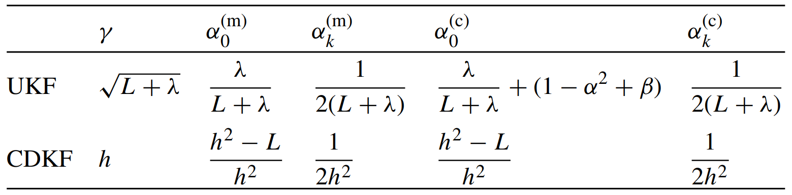
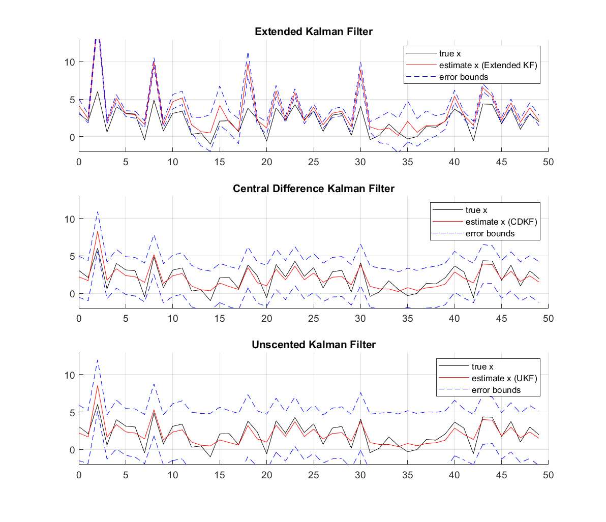

# Nonlinear Kalman Filter 
## 1. Extended Kalman Filter
EKF uses Taylor series to linearize the system equation. 

#### Prediction step:

#### Correction Step:

## 2&3. Central Difference Kalman Filter(CDKF) and Unscented Kalman Filter (UKF)
Given mean and covariance, create 2 more input points that are located gamma standard deviation away from the mean.

with tuning parameters shown in table below:

  

## Final Result (Comparing EKF, CDKF, and UKF)

  

## Reference
[1] Eric A. Wan, Rudolph van der Merwe. The Unscented Kalman Filter for Nonlinear Estimation. Oregon Graduate Institute of Science & Technology, Feb 2000

Code Progress: 

Readme Progress: 
